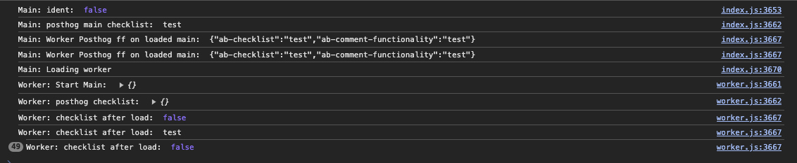
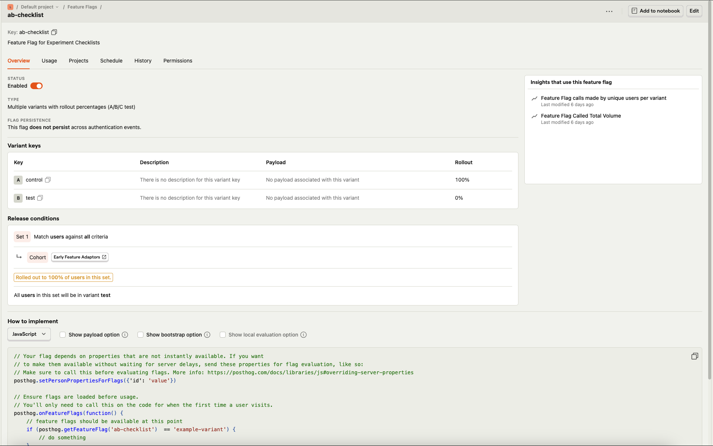

Here’s a more polished version of your README with formatted CLI blocks for the npm commands:

---

# Steps to Reproduce

1. Install the required dependencies by running the following command:

   ```bash
   npm install
   ```

2. Add your PostHog key and UserID in the `env.ts` file.

3. Start the application with:

   ```bash
   npm start
   ```

If you open the console, you should notice that the logs in `worker.ts` (line 27) are being called repeatedly.

This issue does not occur in the main thread (`index.ts`); it only appears in the WebWorker thread. Additionally, the values logged are incorrect. They are correct the first time the `onFeatureFlags` callback is triggered but then get overwritten with incorrect values.

## Console Screenshot


## Posthog Feature Flag Config

